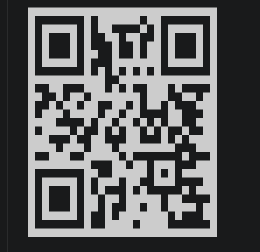

# Rate Repository App

The QR code below points to the published EAS Update manifest.

### iOS

Published EAS Update: `https://u.expo.dev/update/01a08593-c977-7e52-86d1-9081caf30e7e`

Published iOS EAS Update: `https://u.expo.dev/update/01a08593-c977-7e8f-82b9-70ddffa02072`

For Expo Go development, run `npx expo start` from `rate-repository-app` and scan the QR printed by that command while the phone and computer are on the same network.
